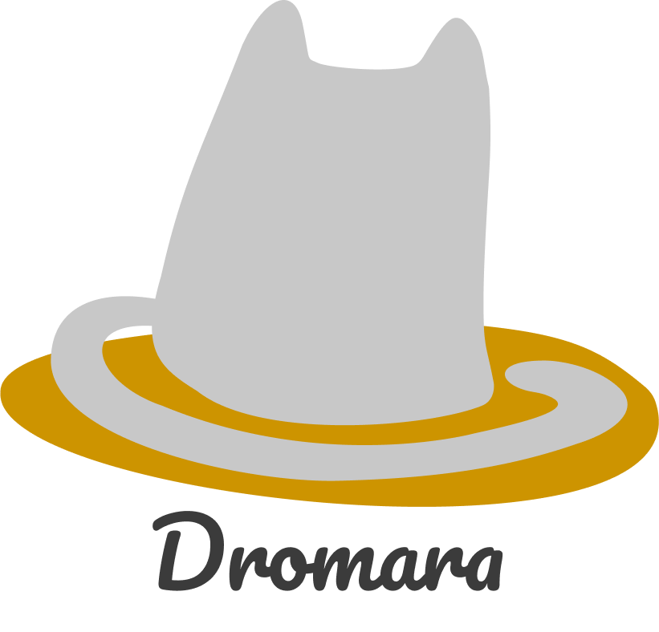
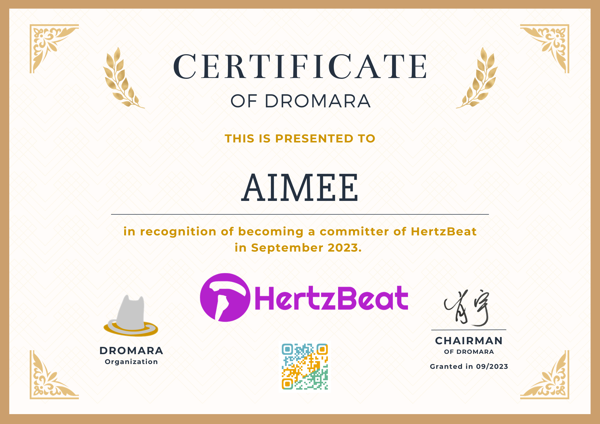

**`Dromara` 是一个由顶尖开源项目维护者自发组织的开源社区，让每一位开源爱好者，体会到开源的快乐。**

> 为往圣继绝学，一个人或许能走的更快，但一群人会走的更远。

## 我们的愿景

让每一位开源爱好者，体会到开源的快乐。

## 社区口号

技术栈全面开源共建、保持社区中立、和谐快乐做开源 。

## 官网

**[https://dromara.org](https://dromara.org)** 是 **Dromara** 开源社区官方网站。

**[https://dromara.org.cn](https://dromara.org.cn)** 是 **Dromara** 开源社区中文官方网站。

## 官方活动

**在 [Dromara社区文档仓库](https://gitee.com/dromara/dromara-doc) 了解我们每一次的会议与活动信息。**

## 加入知识星球

## 开源周边

## 社区项目

#### 目前已加入 **Dromara** 社区的顶级项目包括：

| 顶级项目                                     | Gitee关注量                                                                                                                                | Github关注量                                                                                                               | 项目介绍                               | 加入时间      |
|------------------------------------------|-----------------------------------------------------------------------------------------------------------------------------------------|-------------------------------------------------------------------------------------------------------------------------|------------------------------------|-----------|
| [hutool](https://hutool.cn)              |                        |          | 一个使Java保持甜美的工具类库。                  | 2021.03   |
| [hertzbeat](https://hertzbeat.com)       |                            |                            | 一个拥有强大自定义监控能力，无需Agent的实时监控系统。                                                        | 2022.02 |
| [Sa-Token](https://sa-token.cc)          |                    |      | 一个轻量级 java 权限认证框架，让鉴权变得简单、优雅！      | 2021.03   |
| [LiteFlow](https://liteflow.yomahub.com) |                    |      | 一个轻量，快速的组件式流程引擎框架。                 | 2021.03   |
| [Jpom](https://jpom.top)                 |                            |              | 一款简而轻的低侵入式在线构建、自动部署、日常运维、项目监控软件。   | 2021.03   |
| [MaxKey](https://www.maxkey.top)         |                        |          | 业界领先的IAM身份管理和认证产品。                 | 2021.03   |
| [Forest](https://forest.dtflyx.com)      |                       |          | 高层的、极简的轻量级HTTP调用API框架。             | 2021.03   |
| [Hmily](https://dromara.org)             |                          |            | 高性能一站式分布式事务解决方案。                   | 2017.09   |
| [TLog](https://tlog.yomahub.com)         |                            |              | 轻量级的分布式日志标记追踪神器。                   | 2021.03   |
| [dynamic-tp](https://dynamictp.cn)       |                         |                          | 轻量级，基于配置中心实现对运行中线程池参数的动态修改，以及实时监控线程池                                                 | 2022.04 |
| [easy-es](https://easy-es.cn)            |                               |                                | 一款简化ElasticSearch搜索引擎操作的开源框架,简化CRUD操作,可以更好的帮助开发者减轻开发负担。                              | 2022.03 |
| [cubic](https://cubic.jiagoujishu.com)   |                          |            | 无侵入分布式监控，致力于应用级监控，帮助开发人员快速定位问题。    | 2021.03   |
| [sureness](https://usthe.com/sureness)   |                   |      | 面向REST API的高性能认证鉴权框架。              | 2021.05   |

### 目前已加入 **Dromara** 社区的孵化项目包括：

| 孵化项目                                                                | Gitee关注量                                                                                                                                          | Github关注量                                                                                                                                       | 项目介绍                                                                                 | 加入时间    |
|---------------------------------------------------------------------|---------------------------------------------------------------------------------------------------------------------------------------------------|-------------------------------------------------------------------------------------------------------------------------------------------------|--------------------------------------------------------------------------------------|---------|
| [DbSwitch](https://dbswitch.gitee.io/docs-site/)                    |                             |                              | 异构数据库迁移同步(搬家)工具。                                                                     | 2023.11 |
| [Mayfly-Go](https://www.yuque.com/may-fly/mayfly-go)                |                           |                            | web版 linux、数据库、redis、mongo统一管理操作平台。                                                  | 2023.10 |
| [WeMQ](https://wemq.nicholasld.cn/)                                 |                                     |                                      | 开源、高性能、安全、功能强大的物联网调试和管理解决方案。                                                         | 2023.09 |
| [X-File-Storage](https://x-file-storage.dromara.org/)               |                 |                  | 一站式文件存储，聚合对接所有主流存储平台。                                                                | 2023.09 |
| [yft-design](https://www.yft.design/)                               |                         |                          | 基于Canvas的开源版"创客贴"。                                                                   | 2023.08 |
| [Binlog4j](https://gitee.com/dromara/binlog4j)                      |                             |                              | 基于 Java 轻量级的 Mysql Binlog 客户端。                                                       | 2023.08 |
| [DisJob](http://ponfee.cn:8000/login)                               |                                 |                                  | 一个分布式的任务调度框架。                                                                        | 2023.08 |
| [TestHub](http://nsrule.com/)                                       |                               |                                | 一款基于流程编排的自动化测试工具。                                                                    | 2023.08 |
| [CloudEon](http://www.cloudeon.top/)                                |                             |                              | 一款基于kubernetes的云原生大数据平台，致力于简化k8s上大数据集群的运维管理。                                         | 2023.04 |
| [Hodor](https://github.com/dromara/hodor)                           |                                   |                                    | 一款专注于任务编排和高可用性的分布式任务调度系统。                                                            | 2023.04 |
| [sms4j](https://sms4j.com/)                                          |                                   |                                    | SMS4J为短信聚合框架，帮您轻松集成多家短信服务。                                                           | 2023.04 |
| [RuoYi-Vue-Plus](https://plus-doc.dromara.org/)                     |                 |                  | 后台管理系统 重写RuoYi-Vue所有功能 集成 Sa-Token+Mybatis-Plus+Jackson+Xxl-Job+SpringDoc+Hutool+OSS | 2023.04 |
| [stream-query](https://dromara.gitee.io/stream-query/)              |                     |                      | 允许完全摆脱Mapper的mybatis-plus体验！                                                         | 2023.03 |
| [J2EEFAST](https://www.j2eefast.com/)                               |                             |                              | J2eeFAST 是一个 Java EE 企业级快速开发平台。                                                      | 2023.03 |
| [data-compare](https://github.com/dromara/dataCompare)              |                     |                        | 数据库比对工具: hive 表数据比对，mysql、Doris 数据比对。                                                | 2023.03 |
| [payment-spring-boot](https://felord.gitee.io/payment-spring-boot/) |       |        | 最全最好用的微信支付V3 Spring Boot 组件。                                                         | 2023.03 |
| [zyplayer-doc](http://doc.zyplayer.com/)                            |                     |                                                                                                                                                 | 一款适合团队和个人私有化部署使用的知识库、笔记、WIKI文档管理工具。                                                  | 2023.02 |
| [Neutrino-Proxy](https://gitee.com/dromara/neutrino-proxy)          |                 |          | 一个基于netty的、开源的java内网穿透项目。                                                            | 2023.01 |
| [EasyTrans](http://easy-trans.fhs-opensource.top/)                  |                         |                                                                                                                                                 | 一个注解搞定数据翻译,减少30%SQL代码量。                                                              | 2023.01 |
| [open-capacity-platform](https://dromara.org)                       |  |  | 基于Spring Cloud的企业级微服务框架。                                                             | 2023.01 |
| [electron-egg](https://www.yuque.com/u34495/mivcfg)                 |                      |                      | 一个入门简单、跨平台、企业级桌面软件开发框架。                                                              | 2022.12 |
| [RedisFront](https://www.redisfront.com/)                           |                         |                          | 一款开源免费的跨平台 Redis 桌面客户端工具                                                             | 2022.12 |
| [lamp-cloud](https://tangyh.top)                                    |                         |                          | 基于Jdk11 + SpringCloud + SpringBoot 的微服务快速开发平台，其中的可配置的SaaS功能尤其闪耀                      | 2022.11 |
| [go-view](https://www.mtruning.club/#/)                             |                                |                                | GoView 是一个高效的拖拽式低代码数据可视化开发平台。                                                        | 2022.09 |
| [dante-cloud](https://www.herodotus.cn)                             |                       |                        | 企业级技术中台微服务架构与服务能力开发平台                                                                | 2022.08 |
| [x-easypdf](http://www.x-easypdf.cn/)                               |                          |                                                                                                                                                 | 一个用搭积木的方式构建pdf的框架（基于pdfbox）                                                          | 2022.07 |
| [gobrs-async ](https://async.sizegang.cn)                           |                       |                        | 一款功能强大、配置灵活、带有全链路异常回调、内存优化、异常状态管理于一身的高性能异步编排框架                                       | 2022.06 |
| [mendmix](https://www.jeesuite.com)                                 |                                |                                | java企业级应用开发套件，定位是一站式分布式开发架构开源解决方案及云原生架构技术底座                                          | 2022.05 |
| [open-giteye-api](https://giteye.net)                               |               |                | 专为开源作者设计的数据图表服务工具类站点，提供了包括Star趋势图、贡献者列表、Gitee指数等数据图表服务。                              | 2021.03 |
| [fast-request](https://dromara.gitee.io/fast-request)               |                     |                      | IDEA httpClient插件。                                                                   | 2021.12 |
| [northstar](https://www.quantit.tech)                               |                            |                            | 可替代付费商业软件的一站式量化交易平台。                                                                 | 2021.07 |
| [image-combiner](https://dromara.org)                               |                 |                                                                                                                                                 | 专门用于图片合成的工具。                                                                         | 2021.03 |

#### 目前已从 **Dromara** 社区的退休的项目包括：

| 退休项目                                     | Gitee关注量                                                                                                                                | Github关注量                                                                                                               | 项目介绍                               | 加入时间      |
|------------------------------------------|-----------------------------------------------------------------------------------------------------------------------------------------|-------------------------------------------------------------------------------------------------------------------------|------------------------------------|-----------|
| [koalas-rpc](https://dromara.org)        |                |  | 企业生产级百亿日PV高可用可拓展的RPC框架。            | 2021.06   |
| [Myth](https://dromara.org)              |                            |              | 可靠消息分布式事务解决方案。                     | 2017.12   |
| [Raincat](https://dromara.org)           |                      |        | 强一致性分布式事务解决方案。                     | 2017.09   |

**[点击查看全部项目](https://gitee.com/organizations/dromara/projects)**

### 开源项目成长路线

**Contributor**(代码文档等贡献) -> **Committer**(持续项目贡献或有突出贡献者,被PMC推举) -> **PMC**(成为 Committer 2月+，持续贡献积极维护开源项目，被PMC推举)

## 加入组织

**Dromara** 社区欢迎所有热爱开源的小伙伴加入，我们提供完善的社区治理发展与组织成员成长平台。

### Dromara社区成员

#### 如何成为社区成员?

1. 您可以通过对Dromara社区下的开源项目进行贡献(代码，文档，案例等多种贡献形式)，被推举为**开源项目Committer**后，自动成为**Dromara社区成员**。

#### 社区成员权益与责任

**成员权益**

1. 社区将会在官网，仓库等展示社区成员的信息与荣誉。
2. Dromara社区专属邮箱 eg: `lili@dromara.org`。
3. 作为嘉宾免费邀请至Dromara付费知识星球。
4. 参与社区内部会议，发展计划，活动，线下聚会等。
5. 社区每年的礼物周边(2022年是卫衣,手托)。
6. 各种开源，工作等方面社区资源支持(社区里面大佬很多哦)。

   

**成员责任**

1. 不得从事违法或损害社区和开源项目的事情。
2. 维护社区形象，积极宣传社区。

### Dromara委员会成员

1. 您可以通过对Dromara社区下的开源项目持续贡献，成为**开源项目PMC**，经Dromara委员会投票通过后成为**Dromara委员会成员**。
2. 或您可以直接捐赠您的开源项目，捐赠成功后自动成为**Dromara委员会成员**。

**成员权益**

1. 包含所有上述`社区成员`拥有的权益。
2. 社区事务意见投票权。
3. 社区将会在官网，仓库等展示Dromara社区委员会成员列表。
4. 新晋开源项目提名，委员会成员提名投票等。
5. 宣讲机会，项目推广等社区各方面资源支持。

**成员责任**

1. 不得从事违法或损害社区和开源项目的事情。
2. 主动维护社区，积极宣传社区。

## 组织责任

- 组织不得从事违法或损人利己的事情
- 负责社区新旧捐赠项目评审工作
- 负责新旧社区成员管理工作
- 负责社区下所有孵化项目推广，宣传和项目版本更新日志维护
- 负责统筹和执行社区组织的活动

## 行为准则

- 捐赠项目准则：所有捐赠给 **Dromara** 社区的项目均保留原有项目的所有权利及商业化行为，**Dromara** 社区除协助推广、宣传、运营不做任何干涉，但捐赠项目不得从事违法行为或诋毁 **Dromara** 社区名声。

- 社区成员准则：不得从事违法或损人利己的事情。

- 社区项目：不得从事违法或损人利己的事情

## 项目捐赠

Dromara开源社区组织对捐赠项目有以下最基本条件要求：

- **项目必须是原创且不能是 Fork 版本。**
- 项目必须是完整的应用解决方案。
- 项目必须有良好的代码注释和不断完善的使用文档。
- 项目必须在 Gitee 平台托管且 Stars 关注量大于 100。
- 项目至少在近 2 个月内有实际有效的代码提交记录。
- **项目必须得到 dromara 社区组织评委会的认可。**
- 优先考虑 Gitee 推荐项目或已获得 GVP 的项目。（GVP 项目需联系 Gitee 官方人员取消 GVP 后才能转移到组织，转移成功后恢复 GVP）
- 优选考虑 容器工具、微服务框架和工具、分布式事务、分布式中间件、大数据处理、人工智能、IoT 物联网、开发/测试/运维相关工具链等领域项目。

**[点击查看项目捐赠](https://gitee.com/dromara/dromara/blob/master/project-donate.md)**

## 项目毕业

- **项目负责人根据项目的运营与发展情况，进行申请毕业。**
- **TOC委员会进行投票，超过 3 票同意。**

## 项目退出

- **必须得到TOC委员会 3/4 以上委员的同意。**

## 赞助/支持

**Dromara** 社区能够持续运营和提供更加优质的服务离不开大家的支持。如果想成为 **Dromara** 社区赞助商或支持者，请考虑支持：

**Dromara** 社区承诺将收到的所有赞助支持资金完全公开化，且后续资金用途仅限于 **Dromara** 社区运营支出。

**[点击查看全部赞助商](https://dromara.gitee.io/donate.html)**

## 联系我们

- 捐赠项目/加入组织：[xiaoyu@dromara.org](mailto:xiaoyu@dromara.org)
